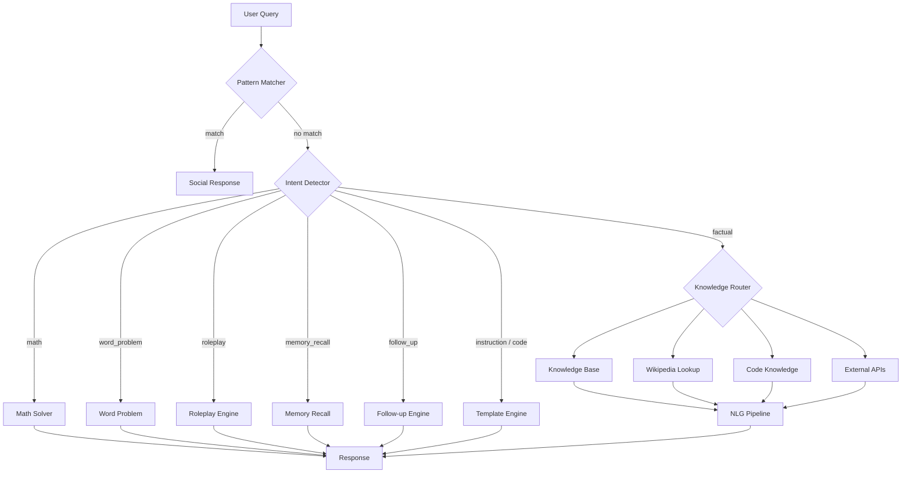

# Architecture

COS is a purely symbolic conversational engine. It processes every query through a fixed pipeline of intent detection, handler routing, knowledge retrieval (if needed), and response assembly.

## High-level pipeline

## State management

All mutable state lives in `cos/state.py`:

- **conversation_history.** List of `(query, response)` tuples, appended at every turn
- **current_roleplay.** The active roleplay persona name, if any
- **fact_memory.** Dict mapping attribute keys to value lists, e.g. `{"food": ["pizza"], "pet": ["cat"]}`

Every module imports what it needs from state. There are no circular dependencies. This is more than some LLM projects can say about their codebase.

  "the state is fine"

## Module overview

### `cos/engine.py`

The main orchestrator. The `process_query()` function is the single entry point for all query processing. It:

1. Checks for simple greetings and farewells
2. Checks social/emotional patterns from `data/patterns/*.json`
3. Detects single-word commands (e.g. "longer", "more", "elaborate")
4. Resolves context-dependent queries using conversation history
5. Tries context-aware template engine
6. Checks coding queries against the code knowledge base
7. Checks external API queries (weather, time, dictionary)
8. Detects false premises (pseudoscience, non-existent concepts)
9. Runs intent detection
10. Extracts and stores user-stated facts
11. Routes to the appropriate handler
12. Quality-checks the response for template artifacts
13. Falls back to Wikipedia retrieval + NLG if needed
14. Returns the response

### `cos/intent.py`

Classifies queries into one of these intents:

- **math.** Arithmetic expressions like "2 + 3 * 4" or "25 times 4 plus 10"
- **word_problem.** Math problems with units, quantities, and context like "How many miles..."
- **roleplay.** Character requests like "pretend to be a pirate" or "act as Shakespeare"
- **instruction.** Writing, coding, creative tasks like "write a poem" or "write a function"
- **code.** Programming-specific queries with keywords like "implement", "function", "algorithm"
- **follow_up.** MT-Bench Turn 2 rewrites like "rephrase your previous response" or "rewrite as a limerick"
- **memory_recall.** Questions about what the user previously said like "What do I like?"
- **factual.** General knowledge questions like "What is the capital of France?"

Each intent is detected by regex patterns and keyword matching, ordered by priority to prevent false positives (for example, math patterns are checked before factual to catch "what is 2+2" as math).

### `cos/templates.py`

Instruction templates for writing, coding, and reasoning tasks. Each template is a Python function that generates structured responses for specific task types:

- Poems with rhyme and meter
- Emails with proper structure
- Short stories with narrative elements
- Blog posts with sections
- Explanations with definitions and examples
- Code implementations with documentation
- HTML pages with CSS and JavaScript
- Evaluation and critique frameworks

The `match_instruction()` function inspects the query and calls the appropriate template or falls back to a generic response.

### `cos/template_engine.py`

Context-aware template system for conversational responses. Templates are stored as JSON in `data/knowledge/templates/`. Each template has:

- **triggers.** Phrases that activate the template
- **context_role.** Whether the template requires conversation context
- **template.** Response text with `{context}` placeholders
- **fallback.** Response when no context is available
- **style.** Casual, formal, etc.
- **response_length.** Short, medium, long

The engine resolves `{context}` placeholders to the last discussed topic by extracting noun phrases from recent conversation history.

### `cos/pattern_matcher.py`

Loads social/emotional response patterns from `data/patterns/*.json`. Each JSON file contains categories with:

- **patterns.** List of regex strings
- **response.** String or list of strings (random choice if list)

Patterns are matched by file order, first match wins. Categories include greetings, farewells, thanks, apologies, happiness, sadness, anger, confusion, compliments, insults, philosophical questions, and dozens more.

### `cos/memory.py`

Extracts user-stated facts from statements like "I like pizza" or "I have a cat" and stores them in `fact_memory`. The `recall()` function answers questions like "What do I like?" or "Do I have a cat?" directly from memory without invoking any other pipeline.

### `cos/roleplay.py`

Defines character personas with detection keywords, introduction responses, and follow-up handlers. Each persona is registered with:

- Detection keywords (e.g. "einstein", "pirate", "sheldon")
- An introductory in-character response
- A follow-up handler for continued conversation

Personas currently include Einstein, pirate, Sheldon Cooper, Shakespeare, chef, detective, professor, travel guide, historian, scientist, Tony Stark, ML engineer, math teacher, and doctor.

### `cos/math_solver.py`

Multi-strategy math solver covering:

- **Simple arithmetic.** Expression evaluation with operator word normalization
- **Distance-time-rate.** Speed * time = distance problems
- **Percentage.** "What is 5% of 200?" and "What percent of 200 is 10?"
- **Survey probability.** Inclusion-exclusion problems like "A survey of 100 people found that 60 like coffee, 40 like tea, and 20 like both"
- **MT-Bench specific.** Triangle area from coordinates, dice probability

Each strategy is tried in order until one produces an answer.

### `cos/followup.py`

Handles MT-Bench Turn 2 follow-up queries that request response rewrites:

- Rephrase or rewrite previous response
- Start every sentence with the letter A
- Add metaphor or analogy
- Rewrite as a limerick
- Evaluate or critique previous response

### `cos/context_extraction.py`

A multi-strategy system for extracting keywords, topics, entities, and noun phrases from queries without using neural networks. Strategies include:

- Question pattern extraction ("What is X?" -> X)
- Noun phrase chunking with regex
- Verb-object pattern extraction
- Compound phrase detection
- Content word scoring by part-of-speech cues

Replaces the previous LFM2-350M-Extract and Tiny-LLM models.

### `cos/code_knowledge.py`

Programming knowledge base loaded from `data/knowledge/coding/*.json` with
curated entries for HTML, CSS, JavaScript, React, Python, SQL, and coding
concepts (hash maps, big-O, linked lists). It also classifies queries as
code tasks so they are routed to the synthesizer instead of the Wikipedia
fallback.

### `cos/code_gen.py`

Deterministic code synthesizer (~80 tasks across Python, JS/TS, Java,
C++, C#, Go, Rust, SQL, and bash): detects the language and task from the
query, then assembles runnable code from a template library with a
task-specific explanation. Also builds full websites (HTML/CSS) from a
business type in the topic. All task knowledge is data-driven: patterns,
intros, notes, and per-language templates live in
`data/knowledge/code_tasks/*.json` (see `docs/knowledge.md` for the format
and how to add tasks); `code_gen.py` only contains the loader, language
detection, and composition logic.

### `cos/code_transformer.py`

Edits pasted code and text: language conversion (best-effort mechanical
transpile), error-handling wraps, renames, comments, optimization,
line-by-line explanation, loop conversion, text politeness rewrites,
summaries, and phrasebook translation.

### `cos/code_editor.py`

The fill-in harness: reads a buffer (language, imports, definitions,
indentation, quote style) and fills empty function bodies from the
signature, the function name, module-level state, a `# TODO:` comment, or
a docstring. This is the API editor plugins integrate against (see
[`docs/editor-harness.md`](editor-harness.md)).

### `cos/refine.py`

Iterative refinement: detects follow-up edits ("add a contact form",
"change the accent color to green", "add error handling", "now do the
same in rust") and applies them to the last generated artifact in place.

### `cos/cli.py` + `cos/tui.py`

The opencode-style agent: a console script (`cos`) and dependency-free
full-screen terminal UI that opens a file, routes tasks (fill-in,
transform, generate, refine), shows diffs, and applies edits after
approval, including staging generated artifacts as new files.

### `cos/external_apis.py`

Integrates with free public APIs for real-time data:

- Weather (wttr.in)
- Time zones (WorldTimeAPI)
- Dictionary definitions (Free Dictionary API)
- Exchange rates (Frankfurter API)
- Jokes (Official Joke API, icanhazdadjoke)
- Number trivia (Numbers API)

All services use free public APIs that require no registration or API keys.
